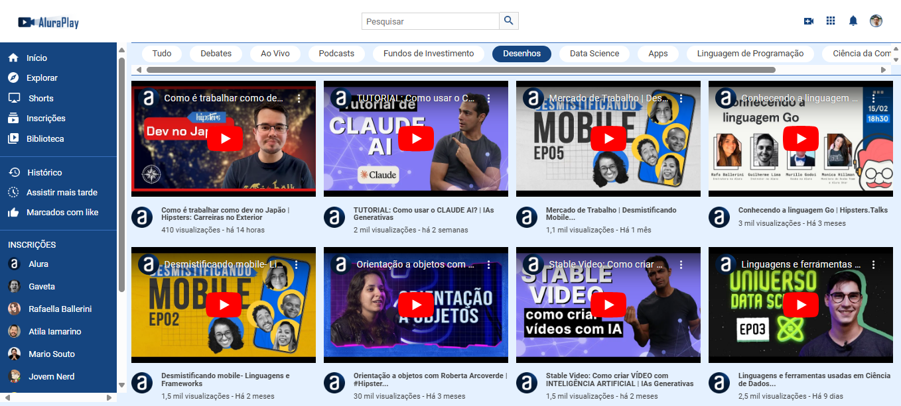

<h1 align="center"> Alura Play </h1>

#### ⚙️ Desenvolvimento de uma plataforma de vídeos com três telas principais, para celulares, tablets e desktops. Construída durante o <em>Oracle Next Education-T7</em> no curso `CSS: Flexbox e layouts responsivos`. ⚙️

 

  

 

## 🛠 Tecnologias

Esse projeto foi desenvolvido com as seguintes tecnologias:

- **[HTML](https://developer.mozilla.org/pt-BR/docs/Web/HTML)**
- **[CSS](https://developer.mozilla.org/pt-BR/docs/Web/CSS/CSS_flexible_box_layout/Basic_concepts_of_flexbox)**
- **[IA - Luri](https://www.alura.com.br/luri-inteligencia-artificial)**
- **[Figma](https://www.figma.com/)**

 

## 🎨 Layout

Você pode visualizar o layout do projeto através [DESSE LINK](https://www.figma.com/design/58USt8VzUEqJy7Acno5WFr/CSS%3A-Flexbox-e-layouts-responsivos-%7C-Alura-Play?node-id=0-1&node-type=canvas&t=UtqMk0LdQZcbAZEQ-0). É necessário ter conta no [Figma](https://figma.com) para acessá-lo.

 

## 📝 License

  

Esse projeto está sob a licença MIT.

 

### 👨‍💻 Autor

 
 <em>Ciro Batista da Silva<em>
 
  

 
👋🏽 Entre em contato!

 

